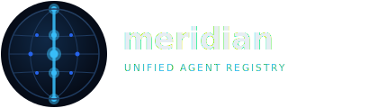

<p align="center">
  
</p>

<p align="center">
  <a href="https://github.com/sujmishra/meridian/actions/workflows/ci.yml"></a>
  <a href="https://github.com/sujmishra/meridian/actions/workflows/ci.yml"></a>
  <a href="https://arxiv.org/abs/2510.08263"></a>
  <a href="https://arxiv.org/abs/2601.14567"></a>
</p>

The identity and discovery layer for multi-agent systems.

Meridian is a **Unified Agent Registry (UAR)** — infrastructure that enables AI agents to
register, discover, and interoperate across heterogeneous frameworks (LangChain, AutoGen,
CrewAI), cloud providers, and organizations.

```
agent://acme.com/workflow/approval/agent_01h455vb4pex5vsknk084sn02q
```

Any agent in the ecosystem — regardless of which framework built it, which cloud it runs on,
or which protocol it speaks — is **discoverable by capability**, **reachable without knowing
its current address**, and **verifiable without a central authority**.

## Architecture

```
Layer 4 ── MEK         Memory → Extraction → Knowledge sharing
Layer 3 ── HAI         SSE streaming, lifecycle control
Layer 2 ── Gateway     Protocol bridge: MCP ↔ A2A ↔ ACP ↔ REST
Layer 1 ── Registry    Capability index, health, governance
Layer 0 ── Identity    agent:// URI · DHT resolution · PASETO attestation
```

See [docs/architecture.md](docs/architecture.md) for the full design.

## Quick start

```bash
git clone https://github.com/sujmishra/meridian
cd meridian
make build && make run
```

## Packages

| Package | Description |
|---------|-------------|
| [`packages/identity`](packages/identity/) | `agent://` URI, TypeID (UUIDv7), PASETO attestation |
| [`packages/registry`](packages/registry/) | Agent records, two-level capability discovery |
| [`packages/dht`](packages/dht/) | Decentralized O(log N) resolution |
| [`packages/gateway`](packages/gateway/) | Protocol bridge and capability-path routing |
| [`packages/hai`](packages/hai/) | Human-agent SSE streaming and lifecycle control |
| [`packages/mek`](packages/mek/) | Memory → Knowledge distillation and sharing |

## Design basis

Meridian synthesizes two research contributions:

- **Co-TAP** [](https://arxiv.org/abs/2510.08263) — three-layer agent
  interaction protocol (HAI / UAP / MEK) and multi-protocol service registry
- **Agent Identity URI Scheme** [](https://arxiv.org/abs/2601.14567) —
  `agent://` URI scheme decoupling agent identity from network topology

## License

[MIT](LICENSE)
